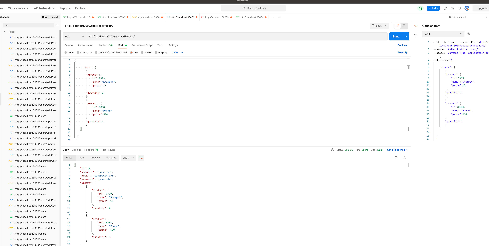

# Test app

This is a quick sample for nodeJs app

## Running Locally

- `npm install`
- `npm start`
- In the browser go to http://localhost:3000/.

### Create User :

`curl --location --request POST 'http://localhost:3000/users/addUser' \ --header 'Content-Type: application/json' \ --data-raw '{ "email": "test@test.com", "username": "john doe", "password": "passcode" }'`

### authMiddleWare

it's a custom middleware to check the token for the following endpoints

- addProduct
  `curl --location --request PUT 'http://localhost:3000/users/addProduct/' \
   --header 'Authorization: user_1' \
   --header 'Content-Type: application/json' \
   --data-raw '{

        "orders": [
            {
            "product":{
                "id":9999,
                "name":"Shampoo",
                "price":10
             },
            "quantity":2
            },
            {
            "product":{
                "id":8888,
                "name":"Phone",
                "price":500
            },
            "quantity":1
            }
        ]

  }
  '`
  

- Remove product

`curl --location --request GET 'http://localhost:3000/users/deleteProduct/9999' \ --header 'Authorization: user_1'`

- update Quantity
  `curl --location --request GET 'http://localhost:3000/users/updateQuantity/9999' \ --header 'Authorization: user_1' \ --header 'Content-Type: application/json' \ --data-raw '{ "quantity":50 } '`
